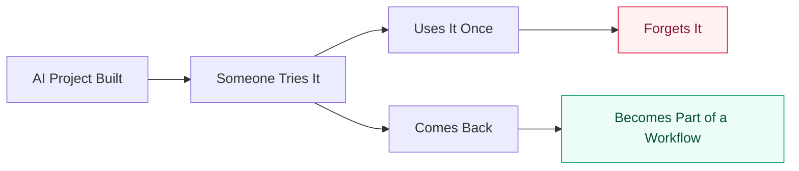
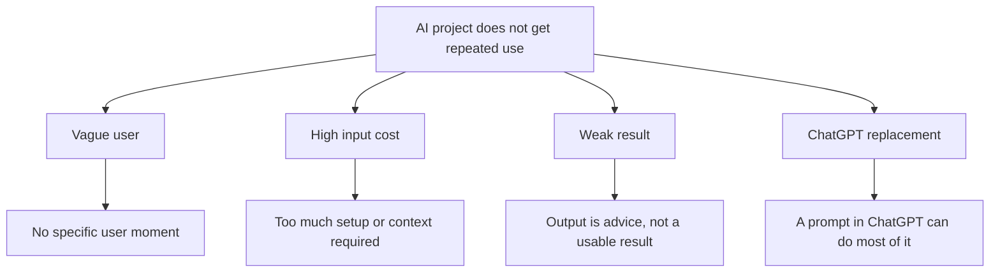
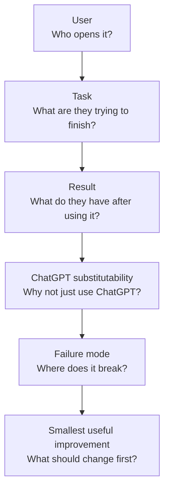

# Why AI Projects Don't Get Used

Most AI project discussions focus on building.

This repository studies something else:

> Why do so many AI projects get built but never become something people repeatedly use?

Most AI projects don't fail because they can't work.

They fail because nobody comes back.



This repository studies the gap between something that works and something people return to.

## The Core Observation

Most AI projects fail after the first use.

Not because they are broken.

Not because the AI is weak.

Because the first use never turns into a habit.

This repository studies that transition:

> Built → Tried → Forgotten

into:

> Built → Returned To → Workflow

## Research Boundary

This is an ongoing, case-based research project about AI product failure analysis.

It is not a definitive theory, startup course, prompt collection, or claim about the real intentions of project authors.

The GitHub autopsies are external observations based only on public repository information.

## Current Dataset

| Source | Count | Notes |
| --- | ---: | --- |
| Public success / strong opportunity cases | 4 | Canva GPT, Consensus, Scholar AI, Apify Skills |
| GitHub low-attention AI projects | 15 | Public README-based autopsies |
| Personal/private cases | 0 public | Kept out to avoid author bias |

GitHub samples are not definitive failures. They are low-attention public examples used to test the framework.

## Core Lens

The current framework looks for four common failure modes:



It also tracks survival paths:

1. Narrow the user
2. Lower the input cost
3. Turn output into a result
4. Connect to real systems
5. Upgrade from tool to workflow
6. Move from generation to execution

## Diagnosis Flow



The question is not:

> Can AI do this?

The question is:

> Why would someone come back and use it again?

## Repository Map

```text
framework/
  failure_modes.md
  diagnosis_process.md
  scoring_system_v0_1.md

autopsies/
  README.md
  github_public_batch_01.md
  github_public_batch_02.md
  github_public_batch_03.md

findings/
  public_success_cases.md
  survival_paths.md
  trust_cost_of_execution_ai.md

templates/
  case_study_format.md
  submission_template.md
```

## Start Here

- [Failure modes](framework/failure_modes.md)
- [Diagnosis process](framework/diagnosis_process.md)
- [Scoring system](framework/scoring_system_v0_1.md)
- [GitHub autopsy batch 01](autopsies/github_public_batch_01.md)
- [Survival paths](findings/survival_paths.md)
- [Trust cost of execution AI](findings/trust_cost_of_execution_ai.md)

## Research Status

This project is intentionally unfinished.

Current status:

- Framework: v1
- Diagnosis process: v2
- Scoring system: v0.1
- GitHub public autopsies: 15

The next useful contribution is not a new framework version.

It is a better case, a counterexample, or a sharper failure pattern.

## Contributing

If you built an AI project that did not get sustained use, you can submit it anonymously.

Use:

- [Submission template](templates/submission_template.md)
- [Case study format](templates/case_study_format.md)
- [Contributing guide](CONTRIBUTING.md)

Counterexamples are welcome.

If a case contradicts the current framework, that is useful data.
